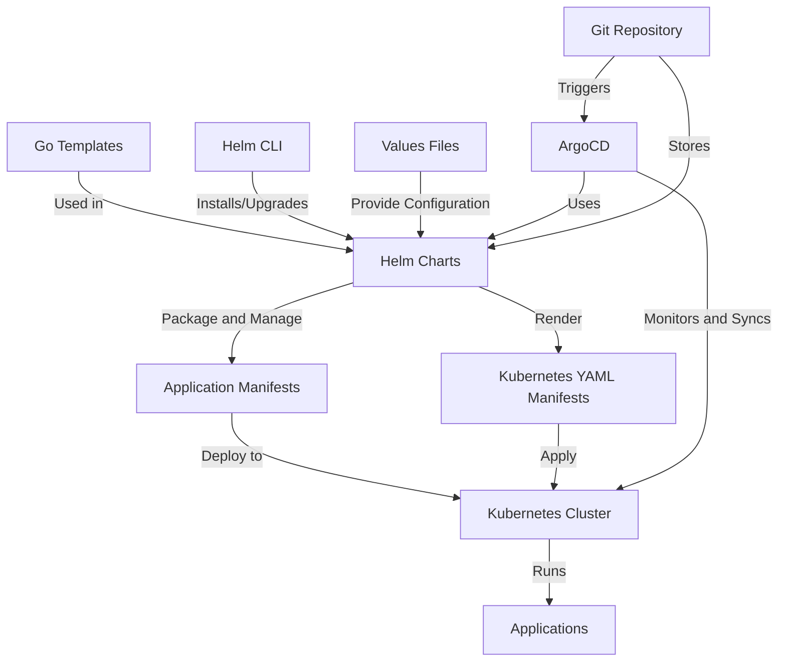

# Architecture

```mermaid
graph TD;
    A[Go Templates] -->|Used in| B[Helm Charts];
    B -->|Package and Manage| C[Application Manifests];
    C -->|Deploy to| D[Kubernetes Cluster];
    D -->|Runs| E[Applications];
    F[Helm CLI] -->|Installs/Upgrades| B;
    G[Values Files] -->|Provide Configuration| B;
    B -->|Render| H[Kubernetes YAML Manifests];
    H -->|Apply| D;
    I[ArgoCD] -->|Monitors and Syncs| D;
    I -->|Uses| B;
    J[Git Repository] -->|Stores| B;
    J -->|Triggers| I;
```