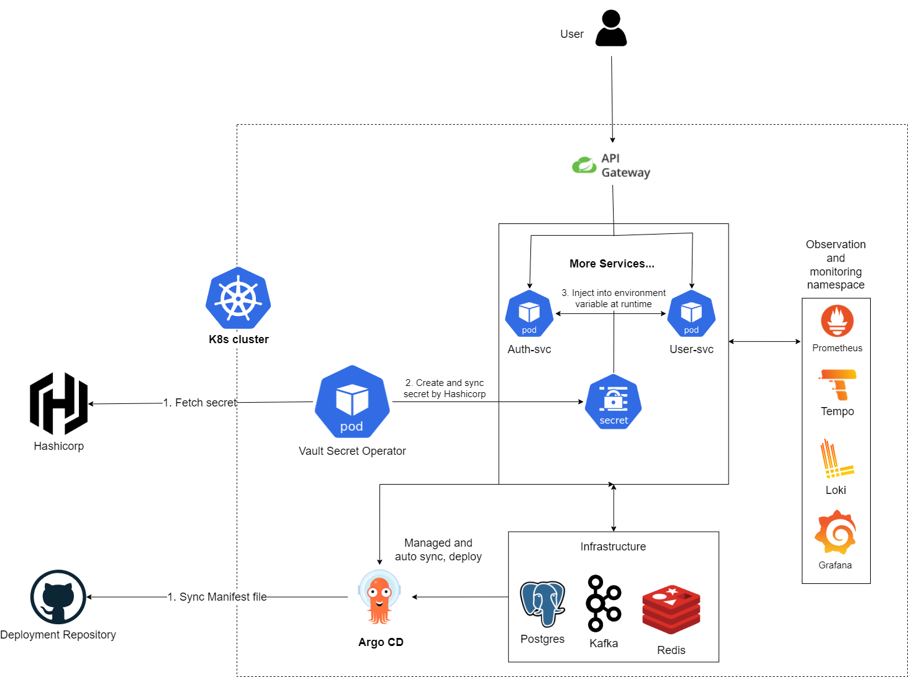
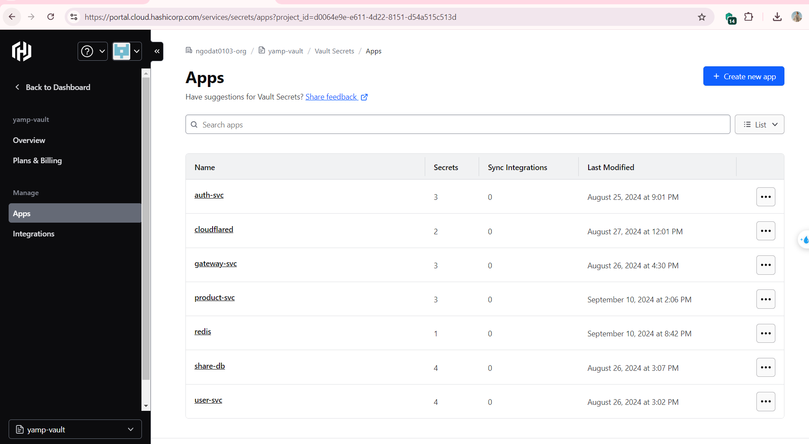
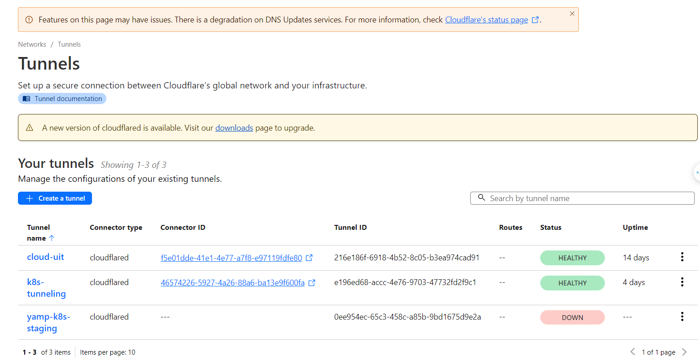
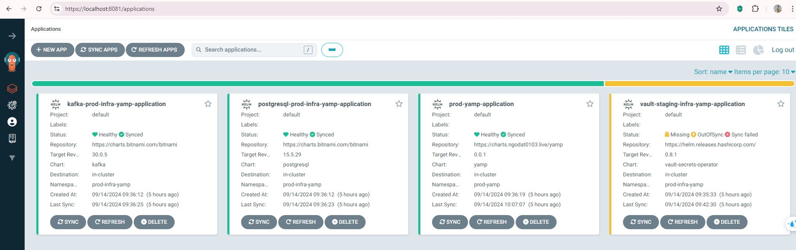
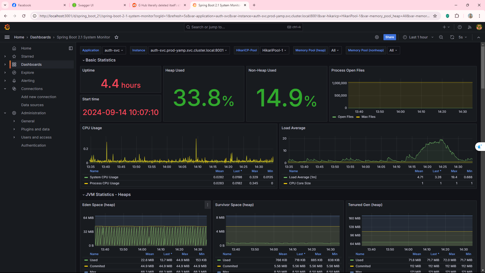
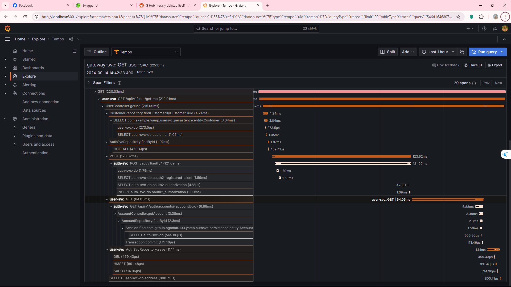
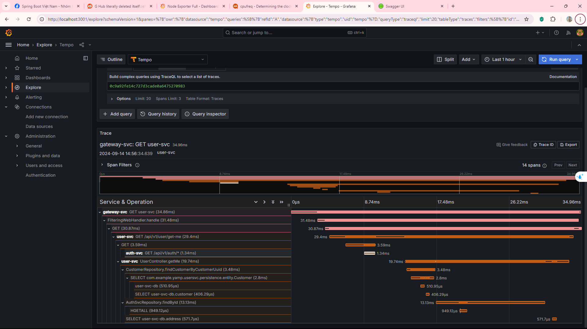

This repository contains some deployment setup for
the [yamp project](https://github.com/ngodat0103/yamp.git).

# Architecture


# Components
1. [Kubernetes](https://kubernetes.io/docs/concepts/overview/): a container orchestration platform.
2. [Hashicorp](https://developer.hashicorp.com/hcp/docs/vault-secrets): a secret management platform. 
I am currently using a secret management platform, but I plan to deploy a dedicated Vault server due to limitations with HashiCorp
3. [Kafka](https://kafka.apache.org/): a distributed event streaming platform.
4. [Vault-secret-operator](https://developer.hashicorp.com/vault/tutorials/kubernetes/vault-secrets-operator): a Kubernetes operator for managing secrets. 
4. [Prometheus](https://prometheus.io/): a monitoring and alerting toolkit.
5. [Grafana](https://grafana.com/): a visualization platform.
6. [Redis](https://redis.io/): a in-memory data structure store.
7. [Tempo](https://grafana.com/oss/tempo/): a distributed tracing platform.
8. [Loki](https://grafana.com/oss/loki/): a log aggregation platform.
9. [Cloudflare tunnel in Kubernetes](https://developers.cloudflare.com/cloudflare-one/tutorials/many-cfd-one-tunnel/): A Cloudflare tunnel to expose the services to the internet.

# Tools have been used
1. [kubectl](https://kubernetes.io/docs/reference/kubectl/overview/): a command line tool for interacting with Kubernetes clusters.
2. [helm](https://helm.sh/): a package manager for Kubernetes.
3. [ArgoCD](https://argoproj.github.io/argo/): a workflow engine for Kubernetes.
# How this project be deployed
1. Register an account on [hashicorp](https://app.terraform.io/signup/account) and create a new organization.
2. Set up and configure the secrets in the vault secrets in the organization.

3. Set up secret management in the Kubernetes cluster, check the [hcp-k8s-operator](./yamp/templates/hcp-k8s-operator) folder.
4. Set up dns in the Cloudflare account, get access token and zone id. I already put accessKey in the Hashicorp Cloud Platform.

5. Set up the Cloudflare tunnel in the Kubernetes cluster, check the [cloudflare-tunnel](./yamp/templates/deployment/cloudflared-deployment.yaml)
, [cloudflare-hcpvaultsecretsapp](./yamp/templates/hcp-k8s-operator/hcpvaultsecretsapp/cloudflared-hcpvaultsecretsapp.yaml)
and [values files](./yamp/values.yaml).
6. Configure the values for infrastructure in the [helm-config](./infra/helm-config) folder
7. Deploying the infrastructure by running the [first_time_setup.sh](./infra/first_time_setup.sh) script. 
8. install the secret for hcp, the only secret for hcp-operator fetching the secret from the Hashicorp Cloud Platform.
9. Deploy the application using argocd by apply the [argocd-application](argocd/prod) folder.
# Some images about the project
## Deployment with ArgoCD

## Monitoring

## Request tracing for some endpoints
### /api/v1/user/get-me
** With no cache **

** With cache **

### /api/v1/user/register


Continue to update...
```


